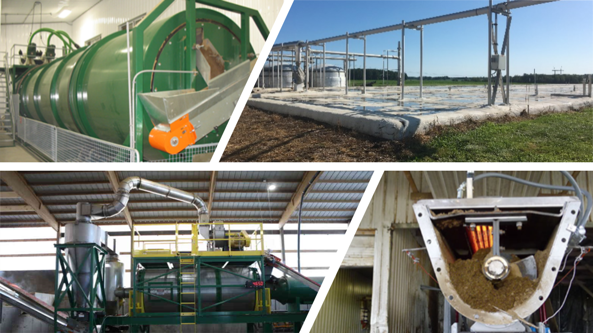

***

This study investigated the associations between recycled manure solids
(RMS) processing systems, used alone or in combination, on the presence
of important pathogens affecting dairy cattle health. Our results showed
that, when used as a stand-alone processing technique, anaerobic
digestion or secondary processing methods (e.g. composting or drying),
reduced the counts of mastitis pathogens, as well as reduced, but did
not completely eliminate, the risk of Mycobacterium avium subspecies
paratuberculosis and Salmonella spp. in ready-to-use recycled RMS
samples. However, combining anaerobic digestion in combination with a
secondary processing method led to the greatest reduction in mastitis
pathogen counts, and completely eliminated Mycobacterium avium
subspecies paratuberculosis and Salmonella spp. in RMS samples. Further
research is needed to confirm these findings, to assess cost-benefit,
and to examine how different processing system combinations may
influence the presence of other pathogens significant to animal health.
 

